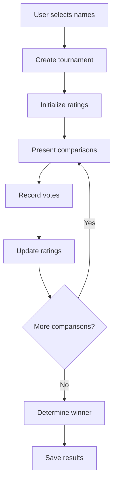

# API Reference

**Status:** ✅ Active Documentation
**Last Updated:** January 2026

This directory contains API reference documentation for Name Nosferatu's external interfaces, services, and integration points.

---

## 🔌 Supabase API Functions

### Core API Modules

```javascript
import {
  catNamesAPI,
  tournamentsAPI,
  siteSettingsAPI,
} from "@/shared/services/supabase/api";
```

### Cat Names API

**Get all names with descriptions:**
```javascript
const names = await catNamesAPI.getNamesWithDescriptions();
// Returns: Name[] with full metadata
```

**Get user statistics:**
```javascript
const stats = await catNamesAPI.getUserStats(userName);
// Returns: UserStats with ratings, wins, losses
```

### Tournaments API

**Create tournament:**
```javascript
const tournament = await tournamentsAPI.createTournament(names, ratings);
// Parameters:
// - names: Name[] - Array of competing names
// - ratings: Rating[] - Current Elo ratings
// Returns: Tournament with ID and initial state
```

**Get user tournaments:**
```javascript
const tournaments = await tournamentsAPI.getUserTournaments(userName);
// Returns: Tournament[] - All user's tournament history
```

---

## 🎣 Custom Hooks

### Tournament Hooks

**Note:** The `useTournament` and `useTournamentManager` hooks have been removed as they are no longer used in the application. Tournament functionality is now handled through the Zustand store and individual hooks like `useTournamentState`, `useTournamentVote`, and `useTournamentHandlers`.

### User Session Hook

```javascript
import { useUserSession } from "@/core/hooks/useUserSession";

const { isLoggedIn, user, login, logout } = useUserSession();
// Returns: Authentication state and methods
```

### Global Store Access

```javascript
import useAppStore from "@/core/store/useAppStore";

const { user, tournament, ui, userActions, tournamentActions, uiActions } =
  useAppStore();
// Returns: Complete application state and actions
```

---

## 🗂️ Database Schema

### Core Tables

| Table | Purpose | Key Fields |
|-------|---------|------------|
| `cat_app_users` | User accounts | `user_name`, `preferences`, `created_at`, `updated_at` |
| `cat_name_options` | Available names | `name`, `description`, `avg_rating`, `categories`, `is_active` |
| `cat_name_ratings` | User ratings | `user_name`, `name_id`, `rating`, `wins`, `losses`, `is_hidden` |
| `cat_tournament_selections` | Tournament history | `user_name`, `name_id`, `tournament_id`, `selected_at`, `selection_type` |
| `cat_user_roles` | Role assignments | `user_name`, `role` (enum: admin, user) |
| `audit_log` | System audit trail | `table_name`, `operation`, `user_name`, `old_values`, `new_values` |
| `site_settings` | App settings | `key`, `value`, `updated_by` |

### Schema Optimizations (January 2026)

**Removed Columns:**
- `cat_app_users.tournament_data` → Migrated to `tournament_selections`
- `cat_app_users.user_role` → Migrated to `user_roles`
- `cat_name_options.user_name` → Names are global
- `cat_name_options.popularity_score` → Calculated dynamically
- `cat_name_options.total_tournaments` → Calculated dynamically

**Added Constraints:**
- Unique constraint on `cat_name_ratings(user_name, name_id)`
- Check constraints on name length (1-100 chars)
- Check constraints on rating ranges
- Non-negative values for wins/losses

### Performance Indexes

**Primary Indexes:**
- `cat_app_users_pkey` - User lookup
- `cat_name_options_pkey` - Name lookup
- `cat_name_ratings_pkey` - Rating lookup
- `tournament_selections_pkey` - Tournament history

**Performance Indexes:**
- `idx_ratings_leaderboard` - Leaderboard queries
- `idx_ratings_user_stats` - User statistics
- `idx_tournament_user_recent` - Recent tournaments
- `idx_cat_name_options_name` - Name searches

### Performance Metrics (Updated January 2026)

- **Bundle Size**: 523KB main bundle (86KB reduction from previous version)
- **Build Performance**: Clean builds with 0 TypeScript errors
- **Code Quality**: 0 linting warnings/errors across 97 files
- **Query Speed**: Optimized with proper indexing and table references
- **Dead Code Cleanup**: Removed 44+ unused exports, 3 unused files

---

## 🔑 Environment Variables

### Required Variables

```bash
# Supabase Configuration
VITE_SUPABASE_URL=https://your-project.supabase.co
VITE_SUPABASE_ANON_KEY=your-anon-key

# Alternative names for Node.js compatibility
SUPABASE_URL=https://your-project.supabase.co
SUPABASE_ANON_KEY=your-anon-key
```

### Getting Supabase Credentials

1. Visit [Supabase Dashboard](https://supabase.com/dashboard)
2. Select your project → Settings → API
3. Copy Project URL and anon public key
4. Use environment variables (never commit keys to code)

### Local Development

For local Supabase development:
```bash
# Install CLI
pnpm add -g supabase

# Start local instance
supabase start

# Use provided local URLs
```

---

## 🔄 Data Flow Patterns

### Tournament Lifecycle



### State Management

- **Zustand**: Client state (UI, preferences, navigation)
- **TanStack Query**: Server state (API data, caching)
- **Local State**: Component-specific state

### Error Handling

```javascript
// API calls include error boundaries
try {
  const result = await apiCall();
} catch (error) {
  // Graceful degradation
  showErrorToast(error.message);
}
```

---

## 🔒 Security & Authentication

### Row Level Security (RLS)

All database tables use Supabase RLS policies to ensure:
- Users can only access their own data
- Public read access for shared content
- Admin-only access for system settings

### Authentication Flow

```javascript
// Automatic session management
const { user, login, logout } = useUserSession();

// Session persists across browser sessions
// Automatic token refresh
// Secure logout with cleanup
```

### Data Validation

- **Client-side**: Zod schemas for form validation
- **Server-side**: PostgreSQL constraints and triggers
- **API Layer**: TypeScript interfaces with runtime validation

---

**This API provides a solid foundation for building tournament and name management features with proper security, performance, and developer experience.** 🚀